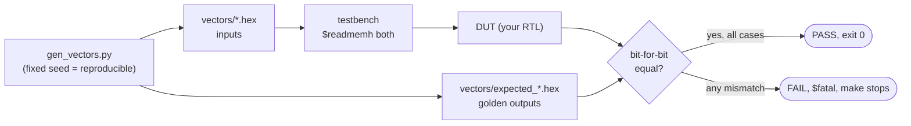

# Stage 02 — Golden models and the first SemNPU blocks

**Needs board: no.** This stage builds the datapath blocks that become the
semantic/inference coprocessor in stage 07 — and teaches the verification
discipline used for every block from here on.

## The golden-model workflow

```
python/gen_vectors.py          Verilog testbench
        |                            |
        v                            v
 vectors/*.hex  ---$readmemh--->  drive DUT, compare every output
 (inputs + expected outputs)      exit non-zero on any mismatch
```



Python computes the truth. Hardware must agree with it, bit for bit,
on hundreds of random cases plus directed edge cases. If you ever change
the RTL, `make` re-proves it. This is exactly how you'll validate the
int8 blocks against Edge Impulse feature data later.

## Blocks

| File | Operation | Role in the SemNPU |
|------|-----------|--------------------|
| [rtl/popcount.v](rtl/popcount.v) | count set bits | the primitive everything else uses |
| [rtl/popand.v](rtl/popand.v) | `popcount(a & b)` | binary semantic similarity score |
| [rtl/hamming.v](rtl/hamming.v) | `popcount(a ^ b)` | binary distance between bitset embeddings |
| [rtl/dot8.v](rtl/dot8.v) | streaming int8 MAC | dense-layer / classifier arithmetic |

`dot8` is the important pattern: it doesn't take whole vectors as ports
(a 256-element int8 vector won't fit through a register interface).
It accumulates one `a×b` pair per clock — `clear`, stream N pairs with
`in_valid`, read the 32-bit accumulator. Stage 07 wraps exactly this
interface in memory-mapped registers for the CPU.

The streaming protocol on a waveform — note the accumulator trails the
inputs by one clock (it's a register; see stage 01's lesson):

```
clk       __/‾‾\__/‾‾\__/‾‾\__/‾‾\__/‾‾\__/‾‾\__/‾‾\__
clear     __/‾‾‾‾‾\____________________________________
in_valid  _________/‾‾‾‾‾‾‾‾‾‾‾‾‾‾‾‾‾‾‾‾‾‾‾\__________
a         =========X=  3  X= -2  X=  5  X=============
b         =========X=  4  X=  6  X=  2  X=============
acc       =  ?  == 0 === 0 == 12 === 0 === 10 == 10 ==
                                ^3*4  ^+(-2*6)  ^+5*2
```

## Run it

```powershell
make vectors   # regenerate test vectors (also runs automatically)
make           # run all testbenches against the golden vectors
make clean
```

## Exercises

1. Add `SEM_ARGMAX`: given 4 streamed scores, output the index of the
   largest. Golden-model it in Python first.
2. Pipeline `popand` for 256-bit inputs: register the AND stage, then the
   popcount tree. What does the testbench need to know about latency?
3. Make `dot8` saturate instead of wrap if the accumulator overflows.
   Write a directed test that would catch the difference.
