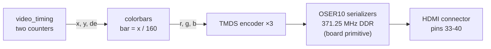

# Stage 03 — HDMI colour bars

**Needs board: for the final step.** The video timing core — the part
people actually get wrong — is built and proven in simulation first.

## Theory in one paragraph

HDMI (in DVI mode) is just VGA timing plus a serializer. A pixel counter
sweeps left→right (0..1649 for 720p), a line counter top→bottom (0..749).
Only a 1280×720 window is "active video" (`de=1`); the rest is blanking,
with sync pulses at fixed offsets. Whatever colour you output while
`de=1` appears on screen. There is no framebuffer — you compute each
pixel's colour *as the beam passes it*. Every stage after this one is
"a smarter function from (x, y) to colour".

## 720p60 numbers (pixel clock 74.25 MHz)

|        | active | front porch | sync | back porch | total |
|--------|--------|-------------|------|------------|-------|
| H (px) | 1280   | 110         | 40   | 220        | 1650  |
| V (ln) | 720    | 5           | 5    | 20         | 750   |

1650 × 750 × 60 = 74,250,000 — that's where the pixel clock comes from.

## The frame, drawn to (rough) scale

The screen you see is just the top-left window of a bigger scanned
rectangle. The beam "flies back" during the porches; syncs tell the
monitor where lines and frames start:

```
        x=0            x=1280   x=1390 x=1430    x=1650
  y=0    +---------------+--------+======+--------+
         |               |        ‖      ‖        |
         |  ACTIVE VIDEO |  front ‖HSYNC ‖  back  |
         |   1280 x 720  |  porch ‖      ‖  porch |
         |   de = 1      |        ‖      ‖        |
         |  (your pixels)|        ‖      ‖        |
  y=720  +---------------+        ‖      ‖        |
         |   front porch (5 lines)‖      ‖        |
  y=725  |=========== VSYNC (5 lines) ============|
  y=730  |   back porch (20 lines)‖      ‖        |
  y=750  +----------------------------------------+
                                  <-40px->
```

And one scanline as a waveform (what a scope on the wire would show):

```
x:      0 ................. 1280 ..... 1390 .. 1430 ...... 1649
de      /‾‾‾‾‾‾‾‾‾‾‾‾‾‾‾‾‾‾‾‾\_____________________________
rgb     <   your colours     ><         black             >
hsync   ______________________________/‾‾‾‾‾‾\_____________
```

`video_timing.v` is nothing but two counters generating exactly this
picture; `tb_video_timing.v` checks the areas add up (de high exactly
1280×720 times per frame, 750 hsync pulses, 1 vsync).

## Where each colour bar comes from

`colorbars.v` is a pure function of x — this is the "no framebuffer"
idea at its smallest:



## What's here

| File | Status |
|------|--------|
| [rtl/video_timing.v](rtl/video_timing.v) | sim-proven timing generator |
| [rtl/colorbars.v](rtl/colorbars.v) | 8-bar SMPTE-ish pattern from (x, y) |
| [rtl/tmds_encoder.v](rtl/tmds_encoder.v) | 8b/10b TMDS video/control encoder |
| [rtl/hdmi_colorbars.v](rtl/hdmi_colorbars.v) | timing + colour bars + three TMDS lanes |
| [tb/tb_video_timing.v](tb/tb_video_timing.v) | counts de/hsync/vsync over a whole frame |
| [tb/tb_tmds_encoder.v](tb/tb_tmds_encoder.v) | checks TMDS control tokens and data symbols |
| [constraints/tangnano20k.cst](constraints/tangnano20k.cst) | verified pins: clock, LEDs, buttons, HDMI |

## Run the sim (today, no board)

```powershell
make        # full 720p timing test + TMDS encoder checks
```

## On the board (when it arrives)

**First: blinky smoke test.** Prove the whole flow with stage 01's design:

```powershell
make blinky.fs                              # yosys -> nextpnr -> gowin_pack
openFPGALoader -b tangnano20k blinky.fs     # LED blinks at 1 Hz
```

**Then: HDMI.** The remaining hardware-specific pieces are Gowin
primitives that can't be simulated with plain iverilog:

1. an `rPLL` making 371.25 MHz from the 27 MHz crystal, plus `CLKDIV` /5
   for the 74.25 MHz pixel clock;
2. `OSER10` DDR serializers pushing 10 bits per pixel clock out the
   differential pins, plus `ELVDS_OBUF` output buffers.

Sipeed's working reference is `vendor/TangNano-20K-example/hdmi/` — it
uses Gowin's DVI_TX IP, so build it once with Gowin EDA to prove your
monitor/cable, then replace the IP with your own encoder + OSER10 under
the open flow. Project Apicula supports OSER10 and the PLL on this chip.

## Exercises

1. Change `colorbars` to draw a white border around the active area —
   the classic "is my monitor cropping?" test.
2. Add a bouncing square (needs two registers updated once per frame —
   use the `vsync` edge as your frame tick).
3. Parameterize `video_timing` for 640×480@60 (25.175 MHz) and re-run
   the testbench with the other numbers.
