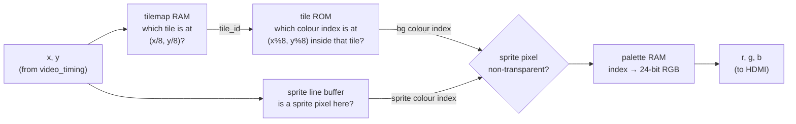

# Stage 04 — Tile/sprite PPU

**Prerequisite: stage 03 colour bars on a real monitor.**

The console's picture processor. No framebuffer — a 720p frame doesn't fit
in BSRAM (see docs/hardware-notes.md). Instead, pixels are generated as
the scan passes, exactly like the NES/Game Boy PPUs.

## Internal resolution

Render 320×180 and pixel-quadruple to 1280×720 (each internal pixel is a
4×4 block). This keeps memory tiny and gives the chunky retro look.

## Memory plan (all BSRAM)

| RAM | Size | Contents |
|-----|------|----------|
| Tile ROM | 256 tiles × 8×8 px × 4 bpp = 64 Kbit | pixel patterns |
| Tilemap | 64×32 entries × 8 bit = 16 Kbit | which tile where (wider than screen for scrolling) |
| Palette | 16 entries × 24 bit | 4-bit colour index → RGB |
| Sprite table | 32 sprites × 32 bit | x, y, tile_id, flags (flip/priority) |

Total ≈ 82 Kbit of 828 Kbit — cheap.

## How a pixel gets its colour

The core PPU idea: the (x, y) coming out of stage 03's `video_timing`
drives a chain of little memory lookups, every single pixel clock:



Work through the arithmetic once by hand: at internal pixel (100, 50),
the tilemap entry is (12, 6), the texel inside that tile is (4, 2).
Divide and modulo by 8 are free in hardware — they're just bit slices:
`x[7:3]` and `x[2:0]`. This is why tiles are 8×8 and not 10×10.

The catch that shapes the whole design: each arrow is a synchronous RAM
read costing one clock, so the lookups **pipeline** — the tilemap read
for pixel x+2 happens while the tile ROM read for x+1 and the palette
read for x are in flight. Start the pipeline 3 pixels before de.

## What's here

| File | What it is |
|------|------------|
| [rtl/tile_sprite_ppu.v](rtl/tile_sprite_ppu.v) | 320×180 pixel generator with scroll inputs, tile-grid background, palette, and 32 deterministic sprite slots |
| [tb/tb_tile_sprite_ppu.v](tb/tb_tile_sprite_ppu.v) | self-checking pixel tests for background, tile edges, sprite priority, and blanking |
| [Makefile](Makefile) | Icarus build/run target used by top-level `make sim` |

Run it:

```powershell
make
```
