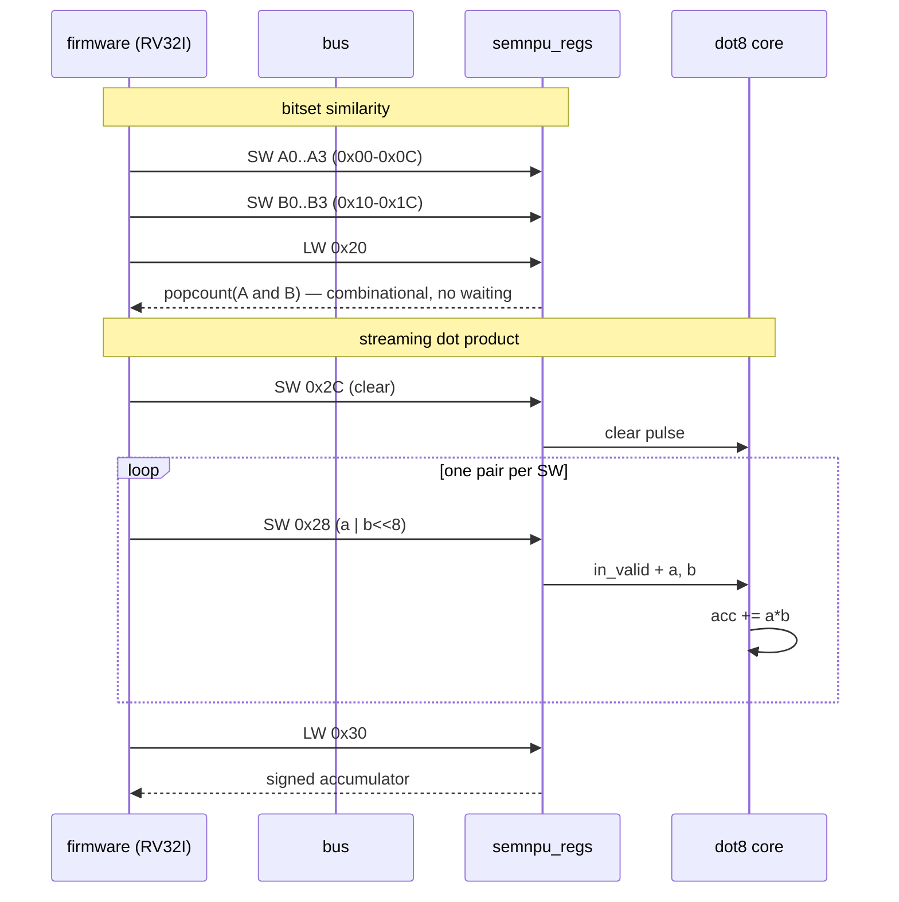

# Stage 07 — The SemNPU coprocessor (register file working in simulation)

The stage 02 blocks wrapped in a memory-mapped register file a CPU can
drive. **Already integrated and proven**: stage 06's testbench boots
PicoRV32 firmware that exercises every register below and checks results
against the Python golden model. Run it from `06-riscv-soc/` with `make`.

## What's here

[rtl/semnpu_regs.v](rtl/semnpu_regs.v) — the register file. Bus protocol:
`sel` pulses one clock per access, `wstrb != 0` means write, reads land
in `rdata` the next cycle.

[tb/tb_semnpu_regs.v](tb/tb_semnpu_regs.v) directly verifies the register
map with the same popand=51, hamming=36, dot8=-5063 fixture used by the
stage 06 firmware. Run it with `make` from this directory.

## Register map (base 0x8000_1000 on the SemRV bus)

| Offset | Name | Access | Function |
|--------|------|--------|----------|
| 0x00–0x0C | A0..A3 | W | operand A, 128 bits as 4 words |
| 0x10–0x1C | B0..B3 | W | operand B |
| 0x20 | POPAND | R | popcount(A & B) — semantic similarity |
| 0x24 | HAMMING | R | popcount(A ^ B) — bitset distance |
| 0x28 | STREAM | W | int8 pair: a=[7:0], b=[15:8]; accumulates a×b |
| 0x2C | CLEAR | W | zero the DOT8 accumulator |
| 0x30 | ACC | R | signed 32-bit dot-product accumulator |

## A full inference call, CPU's-eye view

This is exactly what stage 06's firmware does (and what the stage 08
Zephyr driver wraps in functions):



Two register styles on purpose: POPAND/HAMMING are **combinational
reads** (vectors sit in registers, the answer is always ready) while
DOT8 is **stateful streaming** (too much data to hold in registers).
Every accelerator you'll ever meet is built from these two idioms —
often plus a third, "start + poll done", which arrives with ARGMAX.

The C view (for stage 06 upgrade path / stage 08 driver):

```c
#define SEMNPU ((volatile uint32_t*)0x80001000)
SEMNPU[0x2C/4] = 1;                      // clear
for (int i = 0; i < n; i++)
    SEMNPU[0x28/4] = (a[i] & 0xFF) | ((uint32_t)(b[i] & 0xFF) << 8);
int32_t acc = (int32_t)SEMNPU[0x30/4];   // dot product
```

## Growth plan

1. **ARGMAX**: stream K class scores, read back the index of the max —
   a top-1 classifier head in hardware.
2. **BLOOM**: a bit array in BSRAM + k hash probes; registers for
   key-in / verdict-out (definitely-absent / maybe-present).
3. **Weight memory + batch mode**: store N reference vectors in BSRAM,
   hardware streams A against all of them and returns the best match —
   1-nearest-neighbour in silicon. This is where the 48 DSP multipliers
   start earning their keep (parallel MACs).
4. **PCPI custom instruction**: PicoRV32's coprocessor interface lets you
   make `popcnt rd, rs1, rs2` a real instruction instead of MMIO — the
   "custom RISC-V extension" story, and a stage 08 devicetree exercise.
5. **DMA from SDRAM**: feature vectors too big for BSRAM stream straight
   from the 64 Mbit SDRAM.

## Demos (pick by mood, all after the board arrives)

- **Semantic sprite AI**: NPCs carry feature bitsets; POPAND against the
  player's state bitset picks behavior. The game's "AI" is hardware
  similarity search.
- **Edge Impulse dashboard**: int8 feature vectors over UART, DOT8
  scores against stored weights, stage 04 PPU renders confidence bars.
- **Bloom gate visualizer**: live membership verdicts on screen.
