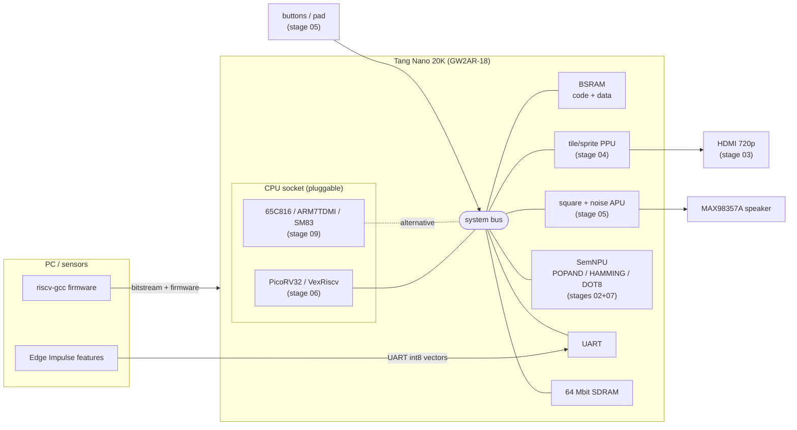
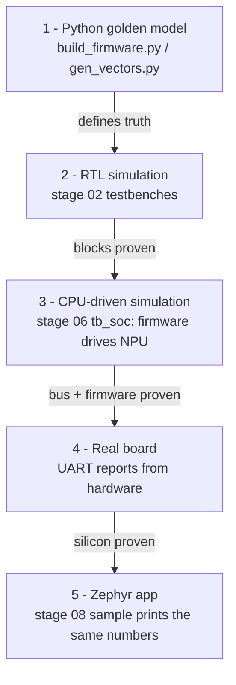
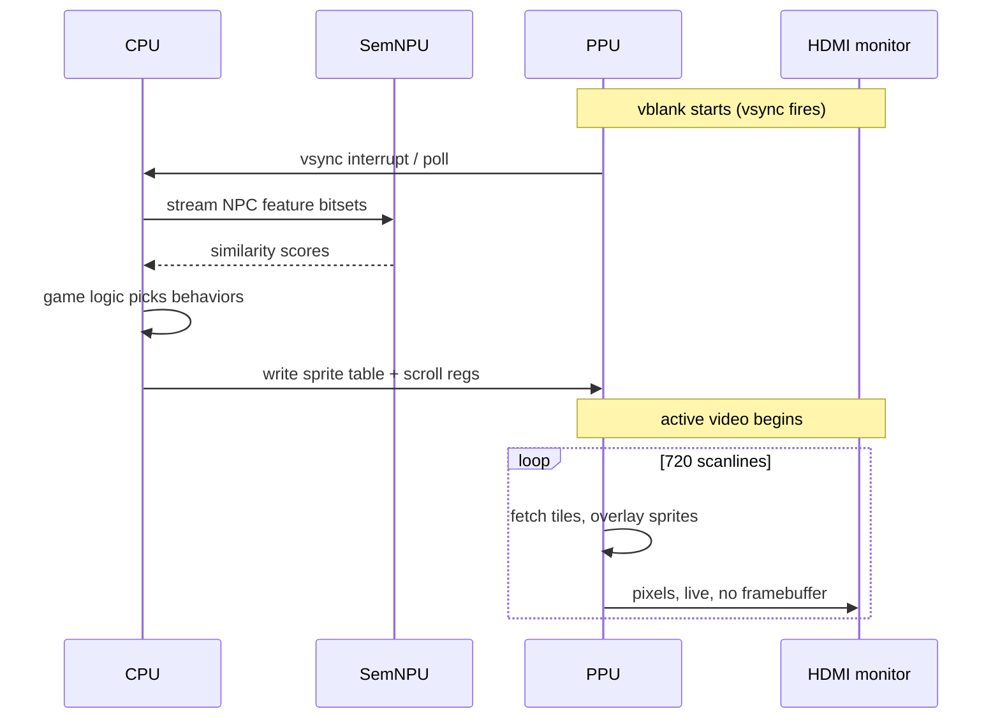

# SemBoy-20K — system architecture

The whole series builds one machine. This page is the map; each stage
README zooms into one box.

## The full system

Everything hangs off one bus with one register map. That is the design
decision that makes the CPU a *socket*: RISC-V and the retro cores see
identical peripherals.

## Global memory map

| Range | Device | Stage |
|-------|--------|-------|
| `0x0000_0000` – `0x0000_0FFF` | RAM (grows later) | 06 |
| `0x4000_0000` – ... | SDRAM (when controller lands) | 06+ |
| `0x8000_0000` – `0x8000_0FFF` | System MMIO: UART, reports, DONE | 06 |
| `0x8000_1000` – `0x8000_10FF` | SemNPU register file | 07 |
| `0x8000_2000` – ... | PPU registers (reserved) | 04 |
| `0x8000_3000` – ... | APU registers (reserved) | 05 |
| `0x8000_4000` – ... | pad/input registers (reserved) | 05 |

Reserve addresses *before* you need them — renumbering a live register
map breaks every layer above it at once.

## The verification stack

The same three numbers (popand=51, hamming=36, dot8=−5063) must come out
of every layer. When a layer disagrees, the bug is in that layer.

## One frame of the console's life

What the finished machine does, 60 times a second:

The hard real-time constraint lives entirely in the PPU (a pixel every
13.5 ns at 720p). The CPU only has to finish its work within vblank —
exactly the contract 8/16-bit console programmers lived by.
